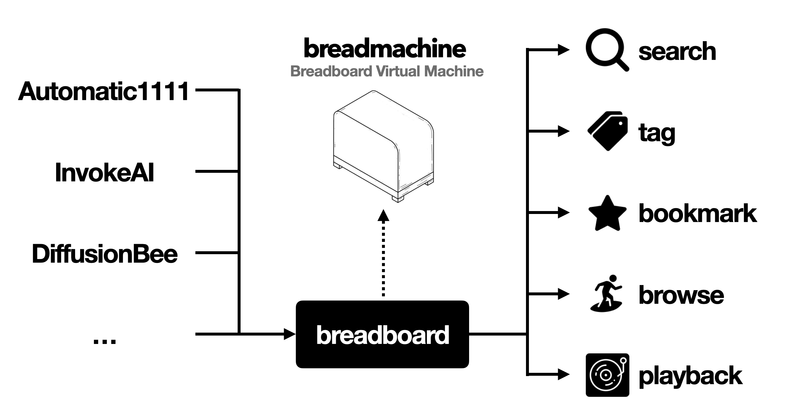
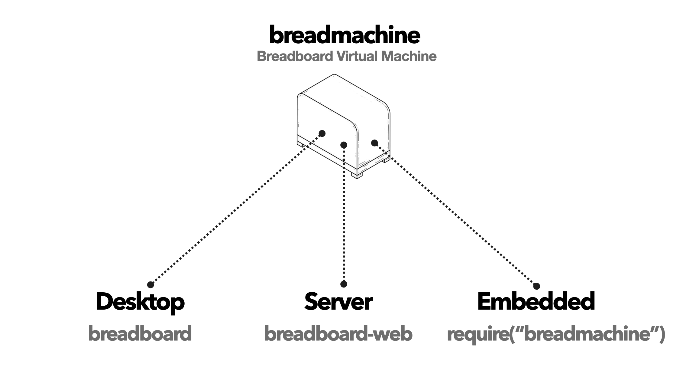
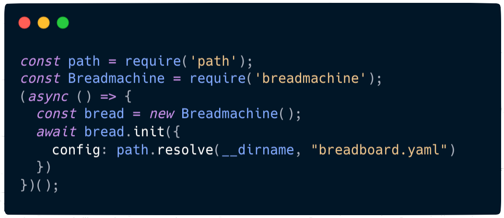

# Breadmachine

<a href="https://github.com/cocktailpeanut/breadmachine" class='inverse btn'><i class="fa-brands fa-github"></i> Github</a>
<a href="https://twitter.com/cocktailpeanut" class='inverse btn'><i class="fa-brands fa-twitter"></i> Twitter</a>
<a href="https://discord.gg/6MJ6MQScnX" class='inverse btn'><i class="fa-brands fa-discord"></i> Discord</a>

---

# What is

## Breadboard

Breadboard is a Stablediffusion browser, that lets you browse and manage all your AI generated files.

<a href="/" class='btn'><i class="fa-solid fa-chess-board"></i> Learn more about Breadboard</a>

---

## Breadmachine

**Breadmachine** is the core **virtual machine** that powers <a href="/">Breadboard</a>, a Stablediffusion browser.

### Embeddable Virtual Machine



Breadmachine is the core engine that powers <a href="/">Breadboard</a>. It was extracted out as a library, so it can be:

1. Embedded into any context
2. Run on non desktop environments


### Breadboard Everywhere



In most cases you do not need to install Breadmachine directly. Instead just use Breadboard. However often you may need **more flexibility.** For example:

1. **Server Install:** Install and run breadboard on a remote server
2. **Multiplayer:** Collaborate with multiple users
3. **Embedded Usage:** Seamlessly embed Breadboard into other applications or workflows


There are two ways to use Breadmachine:

1. **Standalone mode:** Start a standalone server
2. **Embedded mode:** Embed breadboard into other apps

---

# Standalone mode

## Install

Let's first take a look at the standalone mode. Here's the command to install:

```
git clone https://github.com/cocktailpeanut/breadboard-web && cd breadboard-web && npm install
```

Basically it:

1. clones the [breadboard-web](https://github.com/cocktailpeanut/breadboard-web) repository
2. go to the `breadboard-web` directory
3. install dependencies

## Usage

### Start the server

To start the server, run:

```
npm start
```

Now open http://localhost:4200 and you will see breadboard running.

Once you check that the server is running, you may want to customize the server. The [breadboard.yaml](https://github.com/cocktailpeanut/breadboard-web/breadboard.yaml) file is used to customize breadboard.

### Connect folders

By default, it suggests two recommended folders, but you can add as many folders as you want.

You can do this by updating the **folders** property inside `breadboard.yaml`

1. Update the [folders](#folders) attribute inside `breadboard.yaml`.
2. Restart the server
3. Go to the settings tab and click "edit" to go to the connect page, and connect the folders from the recommended list.
4. Finally, click "synchronize".


### Add authentication

When you're running Breadboard locally, you don't really need authentication since you're the only one using your breadboard.

however if you're running breadboard on a server, it is public to the open web, and anyone can access your breadboard.

To password-protect the access to your Breadboard,

1. Update the [accounts](#accounts) attribute in [breadboard.yaml](breadboard.yaml) and set your own custom username/password pairs.
2. Restart the server
3. Enter the username and the password to authenticate and start using.

You can add as many accounts as you want.

### Change port

The default port is `4200`. If you want to use another port:

1. Update the [port](#port) attribute inside the `breadboard.yaml` file
2. Restart the server.

---

# Embedded mode



Breadmachine is just a single NPM module, which means you can integrate Breadmachine easily into any project, simply by importing the module.

In fact, the minimal example code snippet above is the entire code base for the standalone mode web server.


Check here: https://github.com/cocktailpeanut/breadboard-web/blob/main/index.js

## Install

You can install the breadmachine module with:

```
npm install breadmachine
```

To use breadmachine in your app, simply require it like this:

```javascript
const Breadmachine = require('breadmachine');
```

## API

### constructor()

You must first create a breadmachine object:

```javascript
const breadmachine = new Breadmachine();
```

### init()

To start the server, you must call `init()`

#### Syntax

```javascript
await breadmachine.init(options)
```

Where:

- `options`: an object that describes the custom breadboard settings
  - `config`: The file path to a YAML file that declares all the custom configuration


#### Example

Here's an example:

```javascript
const breadmachine = new Breadmachine();
breadmachine.init({ config: "breadboard.yaml" }).then(() => {
  console.log("breadboard running!")
})
```


## Customize

When initializing breadmachine, you can pass a file path to a configuration YAML file to customize Breadmachine.

```yaml
port: 4200
folders:
  - ~/invokeai/outputs
  - ~/.diffusionbee/images
accounts:
  admin: password
  alice: wonderland
```

Currently supported attributes:

1. **port**
2. **folders**
3. **accounts**

### port

You can specify the port at which the breadboard server will run.

If not specified, it will automatically find an available port and use it.

> If you're running breadmachine behind a reverse proxy such as nginx, you may want to specify the port explicitly so it does not keep changing everytime it restarts.

Example:

```yaml
port: 4200
```

### accounts

A property that contains one or more **username/password** pairs for allowing access to users.

Example:

```yaml
accounts:
  admin: root
  alice: alicesupersecretpassword
  bob: bob1212
  carol: southcarolina
```

### folders

An array of folder paths to include in the **"recommended folders" list**.

The folder paths can be:

1. **Absolute path:** You can specify the full absolute path to a folder **(recommended)**
2. **Relative path:** If you specify a relative path, the full path will be auto-determined based on the Breadmachine application folder.
3. **Relative to user home path:** You can use the `~/` syntax to specify a folder path relative to the home path. (Example: `~/invokeai/outputs`, `~/stable-diffusion-webui/outputs`, `~/.diffusionbee/images`)

Example:

```yaml
folders:
  - /User/x/stable-diffusion-webui/outputs
  - ~/invokeai/outputs
  - ~/.diffusionbee/images
```

> Note that this only includes the folders in the "recommended" list.
>
> To connect the folders the users must individually **connect** the folders from the recommended list.
>
> This is to allow each account to choose which folders to synchronize from (instead of assuming everyone wants to synchronize everything).

<br>
<br>
<br>
<br>
<br>
<br>
<br>
<br>
<br>
<br>
<br>
<br>
