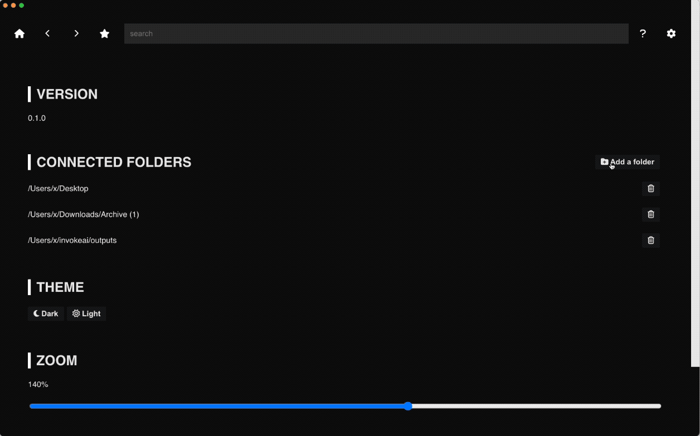
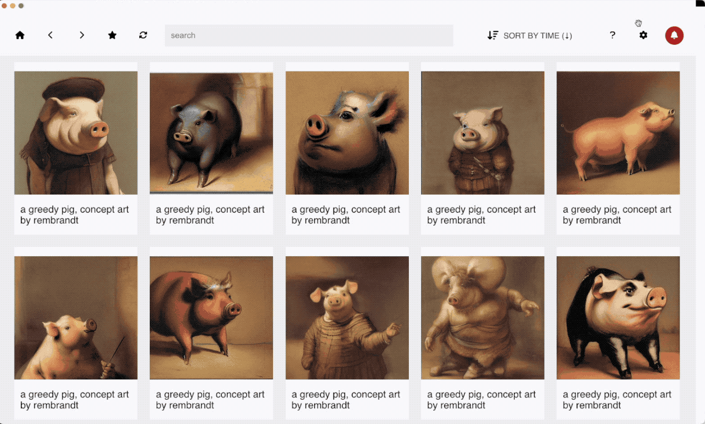

# Breadboard Manual

<a href="#/?id=download" class='btn'><i class="fa-solid fa-file-arrow-down"></i> Download</a>
<a href="https://github.com/cocktailpeanut/breadboard" class='inverse btn'><i class="fa-brands fa-github"></i> Github</a>
<a href="https://twitter.com/cocktailpeanut" class='inverse btn'><i class="fa-brands fa-twitter"></i> Twitter</a>
<a href="https://discord.gg/XahBUrbVwz" class='inverse btn'><i class="fa-brands fa-discord"></i> Discord</a>

> Browse, search, and manage all AI generated images on your machine, in one place.

Breadboard is an AI generated media browser.

It is designed from scratch to let you easily browse, manage, and navigate all your media files generated by AI.

1. **Browse:** Browse images and their extracted metadata in one place
2. **Search:** Quickly search images by prompt
3. **Manage:** select and bulk delete files, drag and drop to any other app for seamless integrated workflows.


---


# Why breadboard?


## Automatic Import

Simply connect breadboard with all your Stablediffusion apps, and it will automatically synchronize with all the files.

Some AI image generator apps are good at doing certain things, and some other apps are better at other things, and as a result many people end up using multiple apps simultaneously to generate images.

> Example: InvokeAI and Automatic1111 are very extensible platforms, but apps like DiffusionBee or PromptToImage are much faster on Mac because they use Apple native engines.

But as we use multiple apps it becomes hard to manage all the generated images in one place. Breadboard acts as a hub to aggregate all the images in one place so you can browse and manage them through a single unified interface.

## Powerful search and filter

Breadboard extracts embedded metadata from all AI generated apps you connect, and creates a comprehensive database.

Then you can easily search and filter all your files through the search bar. You can search not just prompts but through many other ways. For example:

1. **Prompt search:** The most basic feature. Search your files by prompt. Or negative prompt.
2. **Tag filter:** Organize your files into tags and filter them easily.
3. **Attribute filter:** Filter files based on metadata attributes

## Organize files

Breadboard NOT ONLY organizes files automatically, but ALSO lets you proactively organize files using the super-flexible tagging system.

You can attach one or more tags to every file, and filter files based on tags. Here are some example use cases:

1. Filter by a single tag: "Show me all the files I tagged as 'draft'" (Search query: `tag:draft`)
2. Filter by multiple tags: "Show me all the files I tagged simultaneously as 'blackandwhite' AND 'alice'" (Search query: `tag:blackandwhite tag:alice`)
3. Filter by tags and prompt: "Show me all the files I tagged as 'draft', which also include the keyword 'analog style'" (Search query: `analog style tag:draft`)
4. Filter by tags and attributes: "Show me all the files I tagged as 'blackandwhite', generated from a model named 'AnythingV3'" (Search query: `tag:blackandwhite model_name:AnythingV3`)

## Instant playback

> Perfectly play back the AI image generation across platforms and operating systems. No longer need to ask "What was the prompt, seed, cfg scale, and everything?"

"What was the prompt for this image?" is the most frequently asked question on all stablediffusion online communities. Well no more of that!

With breadboard, sharing the instruction becomes as easy as sharing the image itself!

1. Alice connects and synchronizes her Stablediffusion apps with Breadboard
2. Alice shares the synchronized images with Bob
3. Bob plays the image on Breadboard, it displays all the metadta

How does this work?

Breadboard, when synchronizing files, automatically converts all the messy metadata formats into an industry standard XML format (XMP), and embeds this standardized metadata format back to the original file. This makes the "Instant Playback" possible.


1. Prompt
2. Negative Prompt
3. Model Name
4. Seed
5. CFG Scale
6. Sampler
7. Agent name (App name)
8. etc.

## Cross platform

The main design goal of Breadboard is to be portable and cross platform.

1. **Cross platform:** Works on all operating systems. (Windows, Mac, Linux)
2. **Cross client:** Designed to be extensible to all Stablediffusion clients
3. **Portable metadata:** Single unified industry standard metadata format (XMP) to store metadata

## Open source

1. **MIT License:** 100% open license
2. **Easy to contribute:** Written in JavaScript. Super easy to build and contribute.

---

# Download

Breadboard works on all platforms (Mac, Windows, Linux)

---

## Breadboard

### Windows

On widows, you can simply download and run the setup file here:

<a href="https://github.com/cocktailpeanut/breadboard/releases/download/0.3.0/breadboard.Setup.0.3.0.exe" class='big btn'><i class="fa-brands fa-windows"></i> Download for Windows</a>

---

### Linux

From the download links, download the file format supported by your Linux distro and run it:

<a href="https://github.com/cocktailpeanut/breadboard/releases/tag/0.3.0" class='big btn'><i class="fa-brands fa-linux"></i> Download for Linux</a>

---

### Mac

#### 1. Download

Download and run the DMG file here: 

<a href="https://github.com/cocktailpeanut/breadboard/releases/download/0.3.0/breadboard-0.3.0-arm64.dmg" class='large btn'><i class="fa-brands fa-apple"></i> Download for Mac (ARM64 CPU)</a>

<a href="https://github.com/cocktailpeanut/breadboard/releases/download/0.3.0/breadboard-0.3.0.dmg" class='large btn'><i class="fa-brands fa-apple"></i> Download for Mac (Intel CPU)</a>


#### 2. Move to Applications

From the DMG installer, drag the "breadboard" app to the "Applications" folder


#### 3. Run the patch

Now, run the "patch.command" program by **right clicking** and then selecting "open".

It will ask you to enter your system password, in order to


The patch script is ncessary in order to avoid Apple's "Gatekeeper" feature that disallows opening apps that were not published through Apple's own App Store. It is completely secure, and you can check the script code yourself (it's just one line): [script/patch.command](https://github.com/cocktailpeanut/breadboard/blob/main/script/patch.command)

> Learn more here: https://apple.stackexchange.com/questions/436674/how-to-unblock-binary-from-use-because-mac-says-it-is-not-from-identified-develo

#### 4. Open the app

Now just go to the Applications folder and find the breadboard app, and launch it. That's all!

---

## Breadmachine

Sometimes you may want to use Breadboard with more flexibility. For example:

1. **Server Install:** Install and run breadboard on a remote server
2. **Multiplayer:** Collaborate with multiple users
3. **Embedded Usage:** Seamlessly embed Breadboard into other applications or workflows

For this you can use <a href="/breadmachine">Breadmachine</a>, the core virtual machine that powers Breadboard:


<a href="/breadmachine" class='btn'><i class="fa-solid fa-bread-slice"></i> Learn more about Breadmachine</a>

---

# Components

The Breadboard app is made up of 3 area:

1. Top bar
2. Media
3. Bottom bar


## Top bar

The top bar includes various user interfaces to navigate your AI generated media files.

### Home

The home button clears the search bar and displays ALL your aggregated AI generated media in one place.


### Back

Just like a web browser, the back button goes back in history to display the last viewed filter.


### Forward

Just like a web browser, the forward button goes forward in history.


### Bookmark

The bookmark tab displays all the bookmarked filters


### Synchronize

The synchronize button checks all the connected folders to find new files and imports them into Breadboard.


### Search

Enter any keyword to filter your AI generated media. Supports:

1. Prompt search
2. Tag filter: For example `tag:blackandwhite` filters all the files tagged as blackandwhite
3. Attribute filter: Filter by various attributes


### Sort

By default, all your files are displayed sorted in reverse chronological order of creation. You can however sort them using other criteria.


When you click the sort selector, it will display the sort options:


### Help

A help page that includes useful links


### Settings

Customize breadboard to your own needs.

- Connect folders
- Change Theme: Dark mode or light mode
- Zoom: Adjust the font size to your preference
- Re-index: Sometimes you may want to repopulate the breadboard database from scratch.


### Update

Only displayed when there's a new update for the app.

The app checks the github releases feed for breadboard, and if there's a new release and the current version does not match the latest version, automatically displays the alert, so you can go download the latest version.


When you click the bell button, it will display a popup that displays the latest update and its description, and gives you a link to the download page:

.


## Media

Each media object is represented as a card. A card can be expanded or collapsed in the main view.

Here's what a collapsed view looks like:


Here's what an expanded view looks like:


Let's take a look at each component of a media object.


### Header

The header is the top part of the media object representation. You can click the header to select an item WITHOUT expanding it.

Normally when you click on an image, the card will expand. But sometimes you may not want this behavior (for example when bulk selecting multiple items).

In this case you can select the items by clicking the header.


### Image

To expand or collapse an object, you can click on the image.


### Open

When expanded, there are two contextual menu buttons at the top right corner. The first one is the "open in explorer" button.


When you click this button, Breadboard will open the file in the original folder using the native file explorer of your operating system (finder in mac, explorer on windows):


### Full screen

When expanded, there are two contextual menu buttons at the top right corner. The second one is the "full screen" button.

Sometimes you may want to view the image in a full screen mode. The full screen mode lets you do that.


When you click this button, it will display a dedicated full screen image viewer that lets you zoom, rotate, flip, and more:


### View xml


When indexing the files, Breadboard automatically parses the existing metadata on the files, converts them into a unified and machine readable and standardized format (XMP), and attaches this newly converted metadata back to the file. This means your files will now include both the original metadata, AND the converted metadata.

To view the converted metadata, click this button:


When you click, it will display the full XML content:


### Human readable metadata

The rest of the media object view is self-explanatory. The XML is parsed and displayed in a human readable format here.

You can copy the texts easily, or click the hyperlinks to visit each corresponding filter.


## Bottom bar

The bottom bar is displayed only when you select some items, letting you apply actions to the selected items.


### Edit tags

You can click this button to add or remove tags from the selected items.


When you click the "edit tags" button, it will expand to display both the "add tags" and the "remove tags" options:


#### Add tags

- The "add tags" field lets you add one or more tags to the selected items.
- Note that adding tags doesn't overwrite existing tags. It simply attaches the entered tags to the existing metadata. Also, even if you attempt to add redundant tags, Breadboard will only add the tags if it doesn't already exist on each file.
- After adding the tags, Breadboard will automatically send you to the filter page for the added tags.

#### Remove tags

- The "remove tags" field lets you remove one or more tags from the selected items.
- Note that the tags that do not already exist on each file will be simply ignored.


### Delete selection

Breadboard makes it easy to bulk delete files by multi-selecting and clicking "delete selection":


Remember, when you delete them, the original files are deleted.

Breadboard doesn't cache any files so you should treat Breadboard like you're using your file explorer.

### Close

To de-select the currently selected items, either click on the view background, or click the "X" button at the bottom right corner. This will clear all the selection so you can continue browsing.


---

# Howto

## Browsing

### View

Click the images to expand or collapse items:


### Selecting files without expanding

Click the header to select each item WITHOUT expanding the card:


### Multi-select

Multi-select items by clicking the headers while pressing `cmd`, `ctrl`, or `shift` keys:


### Drag to select

You can also drag to select multiple items easily. 

To merge multiple selections, simply hold down the `cmd`, `ctrl`, or `shift` keys while dragging.


## Organizing

### Adding tags


### Removing tags


## Filtering

### Search prompts

Just type in some keywords in the search bar, and it will search all the images with the prompt.

Some example searches:

1. Search keywords: Just regular text search.. Type `"steve buscemi"` to search all images with Steve Buscemi in the prompt
2. Search trigger worlds: Type `"analog style"` to get all the images with Analogdiffusion prompts

Here's an example:


### Surfing tags

You can click on the tags attached to the items to "surf" the tags.

In the following example:

1. We first filter by `tag:blackandwhite` to get all the files tagged as black and white.
2. This includes some snowy night photos, but also some black and white portraits of people.
3. To ONLY get black and white photos of a snowy night, we click `tag:snow`, which sends us to `tag:snow tag:blackandwhite`, which filters down the files to what we want.


### Searching by tags

Of course, you can also directly type the search query in the search bar (In this case `tag:pixelart`):


### Filtering by file paths

You can filter by the file path pattern (This may be useful when you are using certain plugins or apps that automatically generate file names of certain pattern).


First, you will notice that every token in the file path attribute field is hyperlinked, so you can easily click them to drill down your filter using the `file_path:` keyword.

In above example,

1. I start from `alien` search query
2. I click on an item to view its file path, and click on `.diffusionbee`, which filters all the results down to "all alien results with a file path pattern that includes `.diffusionbee`.

Also, you can just type in the `filie_path:` query directly into the search bar:


In above example, I am typing in `file_path:invokeai` to filter only the files with a file path including `invokeai`


We can be very creative with this filter mechanism.

1. We can filter by folder names
2. We can filter by the actual filename patterns
3. We can combine the `file_path` filter with OTHER filters in conjunction

In the following example I am ONLY filtering from files under `stable-diffusion-webui/outputs/txt2img-grids` folder by specifying the file path pattern:


As mentioned, the `file_path` filter is very powerful. It doesn't have to be just the folder name. You can filter very specific file path patterns.


In above example,

1. We start from the search query `rembrandt`
2. Then we inspect an item, and click on a hyperlink that leads us directly to the EXACT file path, which gives us one file (because there's only one file with that name)
3. In this case, I know that the generator app generated the files with a `(number)_(prompt).png` pattern, so to broaden the filter, I get rid of the prefix number, and this gives me more results with that file path pattern.


### Filtering by attributes

Each item has multiple metadata attributes. Some of them are indexed to let you easily filter based on the attributes.

In addition to file path, you can filter based on various other attributes:

- `model_name`
- `agent`: the app that generated the file (`agent:invokeai`, `agent:automatic1111`, `agent:diffusionbee`, etc.)
- `negative_prompt`: `negative_prompt: <keyword>`

## Hyperfilters

### What is a hyperfilter

#### 1. Multi-dimensional filters

Unlike [hyperlinks](https://en.wikipedia.org/wiki/Hyperlink) that send you to **one destination**, **Hyperfilters** let you surf your files in **multiple ways for each attribute**.

When you click a hyperfilter, it will display a popup that lets you choose **how** exactly to use that attribute to filter your files.

In the following example when you click **rainy**, it lets you either visit the **rainy** page or the **≠rainy** page:


#### 2. Browse or Search

1. You can click the hyperfilters in every card to "browse" your files.
2. But you can also directly enter the hyperfilter syntax directly into the search bar.

Here's an example usage of directly entering the hyperfilter into the search bar:


### Syntax


#### Number

There are several integer or float type attributes, such as `width` and `height`. These attributes can be filtered and sorted in various ways:

##### 1. Exact match

The following query syntax will give you the exact match:

```
<attribute name>:<value>
```

For example:

- `width:512`: Get all images with width 512
- `height:512`: Get all images with height 512
- `width:512 height:512`: Get all images with width 512 and height 512

##### 2. Greater than

The following query syntax will give you all the files with the attribute value greater than the specified query value

```
+<attribute name>:<value>
```

For example:

- `+width:512`: Get all images with width GREATER THAN 512
- `+height:512`: Get all images with height GREATER THAN 512
- `+width:512 +height:512`: Get all images with width GREATER THAN 512 and height GREATER THAN 512


##### 3. Less than

The following query syntax will give you all the files with the attribute value greater than the specified query value

```
-<attribute name>:<value>
```

For example:

- `-width:512`: Get all images with width LESS THAN 512
- `-height:512`: Get all images with height LESS THAN 512
- `-width:512 -height:512`: Get all images with width LESS THAN 512 and height LESS THAN 512

##### 4. Greater than or equal to

The following query syntax will give you all the files with the attribute value greater than or equal to the specified query value

```
+=<attribute name>:<value>
```

For example:

- `+=width:512`: Get all images with width >= 512
- `+=height:512`: Get all images with height >= 512
- `+=width:512 +=height:512`: Get all images with width >= 512 and height >= 512

##### 5. Less than or equal to

The following query syntax will give you all the files with the attribute value less than or equal to the specified query value

```
-=<attribute name>:<value>
```

For example:

- `-=width:512`: Get all images with width <= 512
- `-=height:512`: Get all images with height <= 512
- `-=width:512 +=height:512`: Get all images with width <= 512 and height <= 512


#### String

Many attributes are strings. For these attributes you can filter by either the **existence** (positive) or **non existence** (negative) of the filters.

##### 1. Positive filter

The syntax for positive filters is the default syntax. For example:

- `rainy night`: prompt filter
- `tag:nsfw`: tag filter

##### 2. Negative filter

Negative filters are used to EXCLUDE files that match the filters. Here's the syntax

```
-<attribute name>:<value>
```

Examples:

- `-tag:nsfw`: (negative tag filter) Return all files that are NOT tagged as nsfw
- `-:rainy`: (negative prompt filter) Return all files that do NOT include "rainy" in their prompts
- `-file_path:intermediaries`: (negative file path filter) Return all files, excluding the ones whose file paths include "intermediaries" (This includes the parent folder names)

Advanced Examples

- `night -:rainy -:snowy`: get all the "night" images, but remove the ones that include "rainy" and remove the ones that include "snowy"
- `night -:"rainy snowy"`: get all the "night" images, but ONLY remove the ones that include BOTH "rainy" and "snowy" (different from above, only the ones that include both "rainy" and "snowy" will be excluded)


## God filters

God filters are filters that are applied globally throughout the entire application experience.


### Properties

#### 1. Omnipotent

God filters are global filters. They are applied **on top of** all your queries.

If you had `-file_path:txt2img-grids` as a God filter, and searched for "rainy day", this will search all the "rainy day" files, but excluding all the files under the "txt2img-grids" folder.

#### 2. Invisible

While God filters are applied to your browsing, they **do not show up on the search bar**.

For example, if you saved `-tag:nsfw` as a god filter, all your browsing will exclude files tagged as "nsfw", but the `-tag:nsfw` will NOT show up on the search bar every time. The filter is applied in the background silently.

#### 3. Everywhere

God filters are applied everywhere in the app, automatically. For all queries.


### How to use God filters

#### Creating a god filter

There are two steps:

1. Bookmark a filter
2. Go to the bookmarks tab
3. Turn the bookmarked filter into a god filter


#### Turning god filter on and off

It's very easy to turn the god filter on and off. Just click "turn off", and it will be "demoted" to a regular bookmarked filter. Click "make god" again, and it will make it a god filter.

In the following example:

1. We start with a `-tag:nsfw` God filter turned on (which means all NSFW files are not being displayed)
2. We go to the favorites tab, and click "turn off" on the `-tag:nsfw` filter.
3. Now when we go back to the home page, we can see that the NSFW content are being displayed now.


## Playback

### Sharing and playing images

### Viewing XMP


## Bookmarking

With bookmarking, you can save queries and filters and easily revisit them later.

Anything in the browser search bar can be bookmarked, including, searches, tags, attribute filters, and combinations of all of them.


### Bookmarking searches

You can bookmark search queries. In the following example, we are searching "rembrandt", and then bookmarking the search.

The bookmarked search "rembrandt" is then available under the bookmarks tab, and when you click, it sends you to the "rembrandt" search page.


### Bookmarking tags

You can bookmark tags. In the following example, we are searching "tag:pixelart", and then bookmarking the tag filtered results.

The bookmark is then available under the bookmarks tab, and when you click, it sends you to the "tag:pixelart" filtered page.


### Bookmarking attribute filters

Anything in the search bar can be bookmarked. This includes filters based on attributes. In the following example we are filtering by model name pattern (`model_name:analog`, for analog diffusion), then bookmarking it.

The bookmark is then available under the bookmarks tab, and when you click, it sends you to the "model_name:analog" page.


### Bookmarking files

You can "favorite" a file by pressing the heart button (and click one more time to "unfavorite"):


The favorite button is nothing special.

It's just an easy way to tag an item as `"tag:favorite"`, as you can see below:


Because favorites are just another form of tagging, this means you can combine favorites with other filters:

- "Filter all my favorited files with a keyword 'car'": `car tag:favorite`
- "Filter all my favorited files with a tag "blackandwhite": `tag:favorite tag:blackandwhite`
- and more..

You can also find a direct link to `tag:favorite` inside the bookmarks tab:


## Connecting

### Connecting folders

Connecting a folder is easy. Just go to the settings tab and click "Add a folder" to select a folder to connect:



Note that when you add one folder, all its child folders and files will be added automatically!

### Re-indexing folders

Re-indexing Breadboard does the following:

1. Cleans all the indexed entries for the files
2. Starts from scratch to "crawl" all the files on the connected folders and re-indexes the files into the database
3. This includes tags. Even when your database gets corrupted it's all fine because the tags are stored directly on the files, and re-indexing will automatically repopulate the DB!

What it does NOT do:

1. It does NOT touch any files. Files are in tact

You can simply click the "re-index" button inside the Settings tab:


### Connecting normal files

Breadboard is not just limited to AI generated media (even though it's optimized for it!)

Sometimes you may want to connect normal image files to Breadboard. This may be useful for:

1. managing image training sets
2. or simply managing plain image files with the powerful breadboard UI.

Below I'm connecting my `Desktop` folder to auto-import all the PNG files in my desktop folder:


## Customizing

### Theme

You can switch back and forth between **light mode** and **dark mode**. Just go to the settings tab and click "dark" or "light" under the Theme section.




### Font size change


---


# Tips
  - copy texts
  - create sophisticated filters


---

# Supported file formats

Currently supports files generated by the following apps, out of the box:

- Diffusionbee: https://diffusionbee.com
- Automatic111: https://github.com/AUTOMATIC1111/stable-diffusion-webui
- InvokeAI: https://invoke-ai.github.io/InvokeAI/

Designed with extensibility in mind, and can support other formats in the future (Feel free to open an issue to request)

---

# Questions and Feedback

- **Questions:** Join the Discord channel to ask questions https://discord.gg/6MJ6MQScnX
- **News and updates:** Follow the creator on Twitter to stay updated https://twitter.com/cocktailpeanut
- **Requests reports:** Open an issue on Github to share feature requests and bug reports https://github.com/cocktailpeanut/breadboard/issues

---

